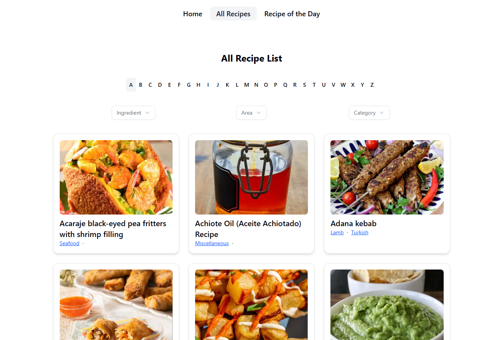

# Recipe Book

Recipe Book is a full-stack web application with a separated frontend (Next.js) and backend (NestJS) located in different folders. Both applications run independently on separate ports and communicate via HTTP APIs.

The project allows users to browse recipes, view detailed cooking instructions, and discover a featured "Recipe of the Day". The backend acts as a dedicated API layer that retrieves and processes recipe data from TheMealDB service, while the frontend provides a responsive and user-friendly interface for interacting with the data.

The application demonstrates a modern full-stack architecture, including REST API integration, server-side communication between services, and deployment of the frontend and backend as independent applications on Vercel and Render.

## Tech Stack

### Frontend
- Next.js 15
- React 19
- TypeScript
- Tailwind CSS
- Radix UI
- Axios

### Backend
- NestJS
- TypeScript
- REST API

### Deployment
- Frontend deployed on Vercel
- Backend deployed on Render
- External API: TheMealDB

## Live Demo

[Frontend (Vercel)](https://recipe-book-ak.vercel.app)

## Home Page Screenshot



## Features

- View all recipes
- Filter recipes by first letter
- Filter recipes by ingredients, area and category
- View recipe details
- Get a random "Recipe of the Day"
- Responsive UI
- REST API integration

## Project Structure

root/:
- backend/ (Nest.js)
- frontend/ (Next.js)
- README.md

## How to start a project

### 1. Clone the repository

```bash
git clone https://github.com/Anna-Kashyra/recipe-book.git
cd recipe-book
```

### 2. Configure .env files
- frontend/.env.local
```bash
NEXT_PUBLIC_API_BASE_URL=http://localhost:5000
```

- backend/.env.local
```bash
RECIPE_API_BASE_URL=https://www.themealdb.com/api/json/v1/1
PORT=5000
```


### 3. Dependency settings

```bash
cd ../backend
npm install

cd ../frontend
npm install
```

### 4. Run both services in parallel terminals

```bash
# Frontend
cd frontend
npm run dev
```

```bash
# Backend
cd backend
npm run start:dev
```

## Resources

To create a user API endpoints was used [Recipe API](https://www.themealdb.com/api.php)

## Stay in touch

- Author - [Anna Kashyra](https://github.com/Anna-Kashyra)

## License

Recipe Book is [MIT licensed](https://github.com/nestjs/nest/blob/master/LICENSE).
